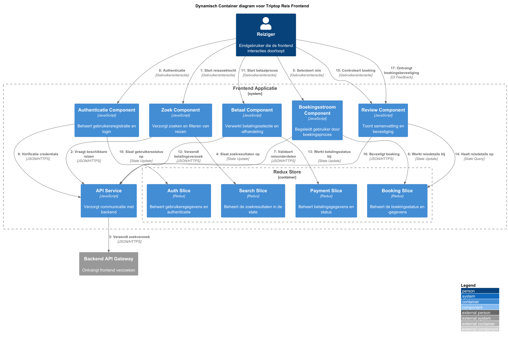

# Software Guidebook Triptop

## 1. Introduction
Dit software guidebook geeft een overzicht van de Triptop-applicatie. Het bevat een samenvatting van het volgende: 
1. De vereisten, beperkingen en principes. 
1. De software-architectuur, met inbegrip van de technologiekeuzes op hoog niveau en de structuur van de software. 
1. De ontwerp- en codebeslissingen die zijn genomen om de software te realiseren.
1. De architectuur van de infrastructuur en hoe de software kan worden geinstalleerd. 

## 2. Context

> [!IMPORTANT]
> Werk zelf dit hoofdstuk uit met context diagrammen en een beschrijving van de context van de software.

Toelichting op de context van de software inclusief System Context Diagram:
* Functionaliteit
* Gebruikers
* Externe systemen

## 3. Functional Overview

Om de belangrijkste features toe te lichten zijn er user stories en twee domain stories gemaakt en een overzicht van het domein in de vorm van een domeinmodel. Op deze plek staat typisch een user story map maar die ontbreekt in dit voorbeeld.

### 3.1 User Stories

#### 3.1.1 User Story 1: Reis plannen

Als gebruiker wil ik een zelfstandig op basis van diverse variabelen (bouwstenen) een reis kunnen plannen op basis van mijn reisvoorkeuren (wel/niet duurzaam reizen, budget/prijsklasse, 's nachts reizen of overdag etc.) zodat ik op vakantie kan gaan zonder dat hiervoor een reisbureau benodigd is.

#### 3.1.2 User Story 2: Reis boeken

Als gebruiker wil ik een geplande reis als geheel of per variabele (bouwsteen) boeken en betalen zodat ik op vakantie kan gaan zonder dat hiervoor een reisbureau benodigd is.

#### 3.1.3 User Story 3: Reis cancelen

Als gebruiker wil ik een geboekte reis, of delen daarvan, kunnen annuleren zodat ik mijn geld terug kan krijgen zonder inmenging van een intermediair zoals een reisbureau.

#### 3.1.4 User Story 4: Reisstatus bewaren 

Als gebruiker wil ik mijn reisstatus kunnen bewaren zonder dat ik een extra account hoef aan te maken zodat ik mijn reis kan volgen zonder dat ik daarvoor extra handelingen moet verrichten.

#### 3.1.5 User Story 5: Bouwstenen flexibel uitbreiden

Als gebruiker wil ik de bouwstenen van mijn reis flexibel kunnen uitbreiden met een zelf te managen stap (bijv. met providers die niet standaard worden aangeboden zoals een andere reisorganisatie, hotelketen etc.) zodat ik mijn reis helemaal kan aanpassen aan mijn wensen.

### 3.2 Domain Story Reis Boeken (AS IS)


### 3.3 Domain Story Reis Boeken (TO BE)


### 3.4 Domain Model


## 4. Quality Attributes

Voordat deze casusomschrijving tot stand kwam, heeft de opdrachtgever de volgende ISO 25010 kwaliteitsattributen benoemd als belangrijk:
* Compatibility -> Interoperability (Degree to which a system, product or component can exchange information with other products and mutually use the information that has been exchanged)
* Reliability -> Fault Tolerance (Degree to which a system or component operates as intended despite the presence of hardware or software faults)
* Maintainability -> Modularity (Degree to which a system or computer program is composed of discrete components such that a change to one component has minimal impact on other components)
* Maintainability -> Modifiability (Degree to which a product or system can be effectively and efficiently modified without introducing defects or degrading existing product quality)
* Security -> Integrity (Degree to which a system, product or component ensures that the state of its system and data are protected from unauthorized modification or deletion either by malicious action or computer error)
* Security -> Confidentiality (Degree to which a system, product or component ensures that data are accessible only to those authorized to have access)

## 5. Constraints

> [!IMPORTANT]
> Beschrijf zelf de beperkingen die op voorhand bekend zijn die invloed hebben op keuzes die wel of niet gemaakt kunnen of mogen worden.

## 6. Principles

> [!IMPORTANT]
> Beschrijf zelf de belangrijkste architecturele en design principes die zijn toegepast in de software.

#### Hoe ga je om met aanroepen van externe services die niet beschikbaar zijn en toch verwacht wordt dat er waardevolle output gegeven wordt?
Het principle wat het beste bij deze vraag past, is het Open/Closed Principle. Dit priciple stelt dat bestaande code niet gewijzigd hoeft te worden 
om nieuwe functionaliteit toe te voegen. <br>
In de context van de ADR bij deze vraag:
- De caching-strategie laat het systeem uitbreidbaar zijn voor verschillende soorten gegevens en verschillende vervaltijden, zonder de kernfunctionaliteit te verwijderen.
- Het systeem kan nieuwe caching-regels toevoegen zonder bestaande implementaties te verstoren.
- Wanneer nieuwe externe services worden toegevoegd, kan het caching-mechanisme hierop worden toegepast zonder dat de basisarchitectuur verandert.

Bovendien maakt dit principe het mgoelijk om in de toekomst eenvoudig andere fallback-strategieën toe te voegen, zonder dat de kernfunctionaliteit van de applicatie
hoeft te worden aangepast. Het systeem blijft gesloten voor wijzigingen in bestaande componenten, maar open voor uitbreiding met nieuwe caching-regels of strategieën.

#### Hoe kunnen we verschillende betalingssystemen integreren voor de verschillende bouwstenen?
Het principle wat het beste bij deze vraag past, is het open-closed principle. Dit principe stelt dat een systeem open moet zijn voor uitbreiding, maar gesloten voor aanpassing. je moet nieuwe functionaliteit kunnen toevoegen zonder bestaande code te hoeven wijzigen. . <br>

In de context van de ADR bij deze vraag:

- Dankzij het Strategy Pattern kunnen nieuwe betaalstrategieën eenvoudig worden toegevoegd zonder dat bestaande strategieën of de controller aangepast hoeven te worden

- Het systeem blijft stabiel en betrouwbaar ook wanneer nieuwe betaalmethodes worden toegevoegd

- De basisarchitectuur blijft ongewijzigd omdat uitbreiding plaatsvindt door toevoeging van losse strategieklassen.

## 7. Software Architecture

###     7.1. Containers

> [!IMPORTANT]
> Voeg toe: Container Diagram plus een Dynamic Diagram van een aantal scenario's inclusief begeleidende tekst.


![Container Diagram Triptop betaalsystemen]

###     7.2. Components

> [!IMPORTANT]
> Voeg toe: Component Diagram plus een Dynamic Diagram van een aantal scenario's inclusief begeleidende tekst.




frontend redux store moeten in slices

###     7.3. Design & Code

> [!IMPORTANT]
> Voeg toe: Per ontwerpvraag een Class Diagram plus een Sequence Diagram van een aantal scenario's inclusief begeleidende tekst.

Maak van de DB class een facade.

### Hoe zorg je dat een wijziging in een of meerdere APIs niet leidt tot een grote wijziging in de applicatie? 

De adapter is zo geschreven dat hij de data die van een externe service afkomt eerst vergelijkt mat wat
de tripService verwacht door checkDataFormat(). Is die niet gelijk aan het verwachtte patroon dan wordt er geen data doorgestuurd. 
Als oplossing voor dit probleem bestaat translateDataFormat(), daarmee zetten we de data om naar het juiste patroon, dit wordt wel doorgestuurd.


#### [Sequence Diagram]


### Hoe maak je de applicatie uitbreidbaar met nieuwe bouwstenen?

Door TripService() uit te breiden met TripServiceV2 (w.i.p. naam) kan er gemakkelijk extra functionaliteit toegevoegd worden aan de applicatie zonder al te veel te hoeven friemelen met de code die in gebruik is.


#### [Sequence Diagram]


### Hoe zorg je ervoor dat je makkelijk een nieuwe externe service kan toevoegen?

Door 'simpelweg' een nieuwe adapter aan de TripService te koppelen kan er een nieuwe externe service gekoppeld worden aan de applicatie


#### [Sequence Diagram]

### Hoe ga je om met aanroepen van externe services die niet beschikbaar zijn en toch verwacht wordt dat er waardevolle output gegeven wordt?
#### Design pattern
Het <b>Strategy Pattern</b> is ideaal in dit scenario, omdat:
1. Het scheidt de beslissing over wanneer en hoe te cachen van de daadwerkelijke implementatie van de caching.
2. Het maakt het mogelijk om verschillende caching-strategieën te definiëren en deze dynamisch te wisselen, zonder de kern van de applicatie te wijzigen.
3. Het kan verschillende caching-algoritmes encapsuleren voor verschillende gegevenstypen en deze configureerbaar maken.
4. Als in de toekomst toch besloten wordt om alsnog meerdere services als fallback toe te voegen, kan dit als een nieuwe strategie worden geïmplementeerd zonder de bestaande code te veranderen.
5. Het stelt het systeem in staat om eenvoudig te schakelen tussen het halen van gegevens uit de cache of van de externe service.

In de context van de ADR zou je een interface kunnen maken voor het ophalen van gegevens, met concrete implementaties voor directe service-aanroepen en cache-gebaseerde ophaalmethoden. Het systeem kan dan
dynamisch wisselen tussen deze strategieën, afhankelijk van de beschikbaarheid van de externe services.

#### Class Diagram


Key components van deze diagram:
1. `DataFetchStrategy` Interface: Dit is de kern van het Strategy Pattern. Het definieert een gemeenschappelijke interface voor alle strategieën om data op te halen, met de methode ```fetchData()```.
2. Concrete strategieën:
- `DirectServiceStrategy`: Haalt gegevens rechtstreeks op via de externe service wanneer deze beschikbaar is.
- `CacheStrategy`: Haalt gegevens uit de cache en valt terug op een alternatieve strategie wanneer er geen cache-data beschikbaar is.
3. `DataFetchContext`: Gebruikt de huidige strategie om gegevens op te halen. Dit stelt de applicatie in staat om tijdens runtime te wisselen tussen verschillende strategieën.
4. `StrategySelector`: Beslist welke strategie gebruikt moet worden op basis van de beschikbaarheid van de service.
5. Ondersteunende klassen:
- `ServiceClient`: Verzorgt de communicatie met externe services.
- `CacheProvider`: Beheert de cache-operaties (opslaan, ophalen, invalideren).
- `RequestParams`: Bevat de parameters voor het verzoek, inclusief het type data dat wordt opgevraagd.
- `Datatype` <b>Enum</b>: categoriseert verschillende typen gegevens voor de juiste TTL-configuratie.

### Hoe kunnen we verschillende betalingssystemen integreren voor de verschillende bouwstenen?
#### Design pattern
Het <b>Strategy pattern + factory pattern</b> is ideaal in dit scenario, omdat:
1. Het zorgt voor een duidelijke scheiding van verantwoordelijkheden tussen betaalstrategieën, objectcreatie en controlelogica.
2. Het systeem flexibel uitbreidbaar blijft zonder bestaande code te hoeven aanpassen (OCP).
3. Nieuwe betaalmethodes eenvoudig kunnen worden toegevoegd met minimale impact op de rest van de applicatie.

In de context van de ADR zou je een interface kunnen maken voor de betaalstrategieën, met concrete implementaties voor elke betaalmethode. De factory kan dan de juiste strategie instantiëren op basis van de gebruikerskeuze of configuratie.
#### Class Diagram


## 8. Architectural Decision Records
### 8.1. ADR-001 API-keuzes voor reisapplicatie

#### Datum: 2025-03-21

#### Status
Voorgesteld

#### Context
Voor de ontwikkeling van onze reisapplicatie hebben we betrouwbare API's nodig die functionaliteiten bieden voor reisplanning, hotelboekingen, vliegreizen en openbaar vervoer.

#### Considered Options
##### Kaarten en routeplanning
| Forces              | Google Maps | TomTom |
|---------------------|-------------|--------|
| Wereldwijde dekking | ++          | +      |
| Nauwkeurigheid      | ++          | ++     |
| Documentatie        | ++          | +      |
| Integratie-eenvoud  | ++          | +      |

##### Vluchtgegevens
| Forces                     | Skyscanner | FlightStats |
|----------------------------|------------|-------------|
| Aanbod vliegmaatschappijen | ++         | 0           |
| Real-time beschikbaarheid  | +          | ++          |
| Prijsmodel                 | +          | -           |
| Documentatie               | +          | +           |
| Boekingsfunctionaliteit    | 0          | -           | 

##### Hotelboekingen
| Forces                  | Booking.com | Hotels.com | Airbnb | 
|-------------------------|-------------|------------|--------|
| Aantal accommodaties    | ++          | +          | +      |
| Boekingsfunctionaliteit | ++          | +          | -      |
| API stabiliteit         | +           | 0          | -      | 
| Integratie-eenvoud      | +           | 0          | -      |

##### Openbaar vervoer
| Forces                 | NS | Deutsche Bahn | 
|------------------------|----|---------------|
| Lokale dekking (NL)    | ++ | -             |
| Internationale dekking | -  | ++            | 
| Real-time updates      | ++ | +             | 
| Kosten                 | -  | ++            | 

#### Decision

Na zorgvuldige afweging van de verschillende API-opties hebben we de volgende beslissingen genomen voor de reisapplicatie:

##### Kaarten en routeplanning
We kiezen voor **Google Maps**. Hoewel de kosten bij schaling een nadeel zijn, wegen de voordelen zwaarder: wereldwijde dekking, uitstekende nauwkeurigheid, uitgebreide documentatie en eenvoudige integratie.

##### Vluchtgegevens
We kiezen voor **Skyscanner**. Het brede aanbod van vliegmaatschappijen is cruciaal voor onze doelgroep. Het gebrek aan directe boekingsfunctionaliteit is acceptabel omdat we kunnen doorverwijzen naar de vliegmaatschappijen.

##### Hotelboekingen
We kiezen voor **Booking.com**. De combinatie van het grootste aanbod accommodaties, uitgebreide boekingsfunctionaliteit en een stabiele API maakt dit de meest geschikte optie. Hotels.com en Airbnb bieden complementaire voordelen, maar de integratie-uitdagingen van Airbnb en de beperktere API-stabiliteit van Hotels.com maken deze minder geschikt als primaire partner.

##### Openbaar vervoer
We kiezen voor een combinatie van **NS** én **Deutsche Bahn**. NS biedt uitstekende lokale dekking en real-time updates voor Nederland, terwijl Deutsche Bahn internationale dekking biedt tegen lagere kosten. De hogere kosten en gebruikslimieten van NS accepteren we omdat lokale reizigers precieze en actuele OV-informatie verwachten. Voor internationale reizen is Deutsche Bahn een kosteneffectieve oplossing met voldoende functionaliteit.

#### Consequences

##### Voordelen
- Hoogwaardige gebruikerservaring door nauwkeurige kaarten en routeplanning
- Brede dekking van vliegmaatschappijen en accommodaties wereldwijd
- Uitstekende OV-informatievoorziening, zowel nationaal als internationaal
- Betrouwbare en stabiele API's met goede ondersteuning

##### Nadelen
- Beperkte directe boekingsfunctionaliteit voor vluchten
- Complexiteit door integratie met meerdere vervoerders (NS en Deutsche Bahn)
- Gebruikslimieten bij NS kunnen bij populariteit een knelpunt vormen

### 8.2. ADR-002 Adapter keuzes voor reisapplicatie

#### Datum: 2025-03-26

#### Status
Voorgesteld

#### Context
Onze Triptop applicatie moet naadloos kunnen integreren met verschillende
externe diensten voor bouwstenen als accommodaties en activiteiten. De applicatie
moet flexibel zijn om:
- Verschillende accommodatiediensten (Zoals AirBnB) te ondersteunen.
- Verschillende activiteitenleveranciers (Zoals TripAdvisor) te integreren.
- Toekomstige wijzigingen in de API's op te kunnen vangen.

Specifieke uitdagingen (Ontwerpvragen)
- Hoe maken we de applicatie uitbreidbaar met nieuwe bouwstenen?
- Hoe zorgen we ervoor dat we makkelijk een nieuwe externe service kunnen toevoegen?
- Hoe voorkomen we grote wijzigingen in de applicatie bij API-veranderingen?

#### Considered Options

| Forces                     | Directe API-integratie | Adapter Pattern |
|----------------------------|------------------------|-----------------|
| Uitbreidbaarheid           | -                      | ++              |
| Externe Service Toevoeging | Moeilijk               | Eenvoudig       |
| API Wijzigings-impact      | Groot                  | Klein           |
| Systeemcomplexiteit        | Laag                   | Gemiddeld       |
| Front-end Stabiliteit      | Laag                   | Hoog            |
| Onderhoudbaarheid          | -                      | ++              |

#### Decision
We kiezen voor Adapter pattern (met service adapters).
Doordat we een abstractielaag tussen de service en onze applicatie wat directe
afhankelijkheden voorkomt en het systeem flexibeler maakt.
Ook krijgt elke externe service zijn eigen adapter.

#### Consequences
##### Positieve effecten
* Minimale impact wanneer externe API's wijzigen
* Voorkomt wijzigingen in de frontend bij backend aanpassingen
* Maximale flexibiliteit bij het toevoegen van nieuwe externe services

##### Risico's
* Toename in systeemcomplexiteit
* Initieel is er meer ontwikkelingstijd nodig

### 8.3. ADR-003 Databasebeslissing

#### Datum: 2025-03-21

#### Status
Voorgesteld

#### Context
We hebben een database nodig voor een applicatie die structured data verwerkt met complexe queries, sterke consistentie vereist en schaalbaar moet zijn.
Wij gaan er van uit dat TripTop uitgroeit tot een applicatie die ver buiten Nederland en uiteindelijk ook wereldwijd gebruikt gaat worden.

#### Considered Options

| **Criteria**             | **MySQL** | **MongoDB** | **CouchDB** |  
|--------------------------|-----------|-------------|-------------|  
| **Schema Flexibiliteit** | +         | ++          | +           |  
| **Query Complexiteit**   | ++        | +           | -           |
| **Schaalbaarheid**       | -         | ++          | +           |
| **Betrouwbaarheid**      | /         | +           | ++          |

Omdat de schaalbaarheid erg belangrijk is voor deze applicatie weegt deze meer bij het overwegen van welk systeem wij gaan gebruiken.

#### Decision
**MongoDB** is de beste keuze vanwege de sterke schaalbaarheid, goede prestaties en prima betrouwbaarheid voor een applicatie die gemaakt is om sterk te groeien en een veeltal aan gebruikers gaat hebben.
1. **Schaalbaarheid**: MongoDB en CouchDB zijn als NoSQL systemen beide beter schaalbaar dan MySQL, met MongoDB als winnaar tussen de twee NoSQL systemen.
2. **Betrouwbaarheid**: CouchDB is in haar kern opgezet als een systeem dat goed kan omgaan met onbetrouwbare / wegvallende hardware en daardoor het meest betrouwbare systeem in deze vergelijking. MongoDB presteert echter beter, met nog steeds ruim voldoende betrouwbaarheid.

#### Consequences 
Schaalbaar systeem voor groeiende gebruikersbasis

- MongoDB maakt horizontale schaalbaarheid mogelijk, waardoor de applicatie goed kan meegroeien met de verwachte internationale uitbreiding.

Flexibele dataopslag

- Door het schema-loze ontwerp kunnen we eenvoudig nieuwe features en datatypes toevoegen zonder grote migraties uit te voeren.

Complexe queries vereisen extra optimalisatie

- In vergelijking met relationele databases kunnen complexe queries lastiger zijn. Indexering en aggregaties moeten goed worden geoptimaliseerd om prestaties te garanderen.

Consistentiemanagement vereist aandacht

- MongoDB biedt configuraties voor strong consistency, maar standaard werkt het met een eventually consistent model. Dit moet goed worden afgestemd op de eisen van de applicatie.

Mogelijke leercurve voor het team

- Als het team meer ervaring heeft met SQL-gebaseerde systemen, kan extra training nodig zijn om MongoDB effectief te gebruiken.

### 8.4. ADR-004 `extends` voor uitbreidbaarheid met nieuwe bouwstenen

#### Datum: 2025-03-28

#### Status
Voorgesteld

#### Context
Onze **Triptop**-applicatie is opgebouwd uit verschillende bouwstenen, zoals vervoer, verblijf en activiteiten. We willen de applicatie uitbreiden met nieuwe bouwstenen, zoals een helikoptertour of een nieuwe activiteit. Om dit te kunnen doen, moet de applicatie flexibel zijn om:

- Nieuwe typen bouwstenen toe te voegen zonder bestaande code te wijzigen.

##### Specifieke ontwerpvraag:
- Hoe maak je de applicatie uitbreidbaar met nieuwe bouwstenen? (Reisservice zelf aanpassen met `extends`)

#### Considered Options

| Forces               | Switch-statement  | Interface + Compositie | `extends` (Inheritance) |
|----------------------|-------------------|--------------------------|--------------------------|
| Uitbreidbaarheid     | +                 | ++                       | ++                       |
| Onderhoudbaarheid    | +                 | ++                       | ++                       |
| Ontwikkelingstijd    | ++                | +                        | ++                       |

#### Decision
We kiezen voor het gebruik van **`extends`** om de applicatie uitbreidbaar te maken met nieuwe bouwstenen. Deze aanpak biedt de meeste flexibiliteit en maakt het mogelijk om nieuwe bouwstenen toe te voegen zonder bestaande code te wijzigen. Door gebruik te maken van `extends` kunnen we nieuwe bouwstenen implementeren door een nieuwe klasse te maken die de bestaande basisklasse uitbreidt. Dit maakt het eenvoudig om nieuwe functionaliteit toe te voegen en bestaande code te hergebruiken.

#### Consequences

##### Positieve consequenties:
- De applicatie is eenvoudig uitbreidbaar met nieuwe bouwstenen
- De ontwikkelingstijd wordt verkort doordat bestaande code hergebruikt kan worden

##### Risico's en beperkingen:
- Het gebruik van `extends` kan leiden tot een complexere codebase als het niet zorgvuldig wordt toegepast
- Unit testing kan uitdagender worden bij veel gedeeld gedrag in de basisklass

### 8.5. ADR-005 Design patterns voor Triptop

#### Datum: 2025-03-28

#### Status
Voorgesteld

#### Context
Om de ontwikkeling van de **Triptop**-applicatie makkelijker te maken willen we gebruik maken van design patterns.

##### Considered Options
##### Hoe maak je de applicatie uitbreidbaar met nieuwe bouwstenen?

| Forces                | Stategy | Factory | Template Method Pattern |Decorator Pattern|Chain of Responsibility|State Pattern|Command Pattern|
|-----------------------|---|---------|------------------------|---|---|---|---|
| Ondersteund extends   |++|+|++|+|+|+|0| 
| flexibiliteit         |++| +|0|+|+|+|+|
| Uitbreidbaarheid      |++|-|+|0|0|0|-|
| Eenvoud implementatie |+|++|0|-|-|-|-|

#### Hoe zorg je ervoor dat je makkelijk een nieuwe externe service kan toevoegen? (Adapters goed schrijven)
| Forces                | Adapter | Facade | Proxy | Bridge | Decorator |
|-----------------------|---|---------|-------|--------|-----------|
| Interface afscherming |++|+| +     | +      | -         |
| API Ondersteuning     |++|+| 0     | +      | -         |
| Makkelijk toevoegen   |++|+| 0     | +      | 0         |
|Testbaarheid           |++|+| +     | 0      | 0         |

#### Hoe zorg je dat een wijziging in een of meerdere APIs niet leidt tot een grote wijziging in de applicatie?
| Forces               |Facade|Anti-corruption layer|Proxy|Decorator|
|----------------------|------|---------------------|-----|---------|
| Schermt front-end af |+|++|+|-|

#### Decision

##### Hoe maak je de applicatie uitbreidbaar met nieuwe bouwstenen?
We kiezen ervoor om voor deze ontwerpvraag de design patern **Strategy** te gebruiken. Met het gebruik van de design patern Strategy kunnen we de applicatie uitbreidbaar maken met nieuwe bouwstenen. Deze aanpak biedt de meeste flexibiliteit en maakt het mogelijk om nieuwe bouwstenen toe te voegen zonder bestaande code te wijzigen. Door gebruik te maken van Strategy kunnen we nieuwe functionaliteit toevoegen en bestaande code hergebruiken.

##### Hoe zorg je ervoor dat je makkelijk een nieuwe externe service kan toevoegen? (Adapters goed schrijven)
We kiezen er voor om voor deze ontwerpvraag de design patern **Adapter** te gebruiken. Met het gebruik van de design patern Adapter kunnen we makkelijk een nieuwe externe service toevoegen. Deze aanpak biedt de meeste flexibiliteit en maakt het mogelijk om nieuwe externe services toe te voegen zonder bestaande code te wijzigen. Door gebruik te maken van Adapter kunnen we gemakkelijk nieuwe API services toevoegen zonder extra code te schrijven ook is het makkelijk om de code met unit tests te testen.

##### Hoe zorg je dat een wijziging in een of meerdere APIs niet leidt tot een grote wijziging in de applicatie?

#### Consequences

##### Positieve consequenties:
- De applicatie is eenvoudig uitbreidbaar met nieuwe bouwstenen
- De ontwikkelingstijd wordt verkort doordat bestaande code hergebruikt kan worden
- De applicatie is flexibel en kan gemakkelijk worden aangepast aan veranderende eisen
- De codebase wordt eenvoudiger en beter onderhoudbaar
- De applicatie is eenvoudig te testen en te onderhouden

##### Risico's en beperkingen:
- Het gebruik van Strategy kan leiden tot een complexere codebase als het niet zorgvuldig wordt toegepast
- Het kan lastig zijn om de juiste strategie te kiezen voor een specifieke situatie
- Het kan moeilijk zijn om te begrijpen hoe de verschillende strategieën samenwerken in de applicatie
- Het gebruik van Adapter kan leiden tot een complexere codebase met veel boiler code
- Het kan voorkomen dat de API verkeerd vertaald wordt naar de intere interface
- Als de API veranderd moet de adapter ook aangepast worden


### 8.6. ADR-006 Service niet beschikbaar

## Datum: 2025-04-01

## Status
Geaccepteerd

## Context

In onze applicatie zijn we afhankelijk van externe services voor het verkrijgen van bepaalde gegevens.
Er zijn situaties waarin deze services tijdelijk niet beschikbaar zijn, maar waarbij van onze applicatie nog steeds
verwacht wordt dat deze waardevolle output levert aan de eindgebruiker. We moeten een strategie bepalen om met deze
uitvalsituaties om te gaan zonder dat de gebruikerservaring ernstig wordt aangetast.

#### Ontwerpvraag
Hoe ga je om met aanroepen van externe services die niet beschikbaar zijn en toch verwacht wordt dat er waardevolle output gegeven wordt?

## Considered Options

| Forces             | Cache | Error | Meerdere services |
|--------------------|-------|-------|-------------------|
| Betrouwbaarheid    | ++    | -     | +                 |
| Actualiteit        | 0     | ++    | +                 |
| Complexiteit       | 0     | --    | ++                |
| Onderhoudskosten   | +     | -     | +                 |
| Gebruikerservaring | +     | --    | +                 |   

## Decision

Na het bekijken van de geschikte opties hebben we besloten om een caching-strategie te gebruiken om met niet-beschikbare
services om te gaan.
1. Implementeer een eenvoudig caching-mechanisme dat gegevens van succesvolle service-aanroepen bewaart.
2. Gebruik de cache automatisch als fallback wanneer een service niet beschikbaar is.
3. Stel passende vervaltijden in, zodat gegevens niet te verouderd raken.

## Consequences
### Positieve gevolgen
- Verhoogde betrouwbaarheid; de applicatie blijft functioneren, zelfs wanneer de services uitvallen.
- Goede gebruikerservaring; gebruikers zullen minder onderbrekingen ervaren.
- Vrij lage complexiteit; relatief eenvoudig te implementeren en onderhouden.
- Kostenefficiënt; geen extra kosten voor extra services.

### Negatieve gevolgen
- Gegevens kunnen mogelijk verouderd zijn; gebruikers kunnen niet altijd de meest recente informatie zien.
- Cache-beheer; een cache vereist monitoring en periodieke evaluatie van vervaltijden.

## 9. Deployment, Operation and Support

> [!TIP]
> Zelf beschrijven van wat je moet doen om de software te installeren en te kunnen runnen.